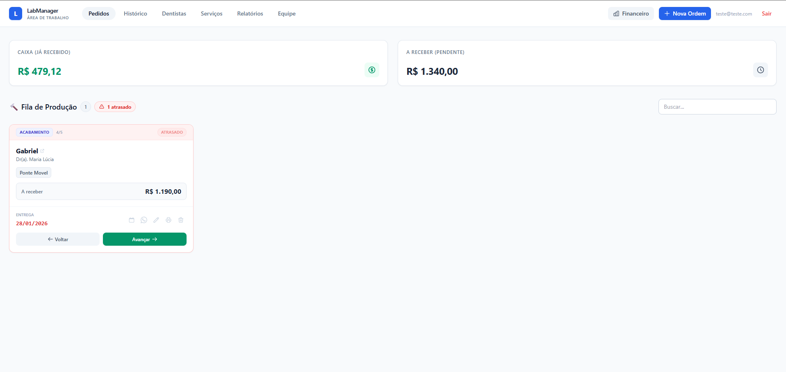
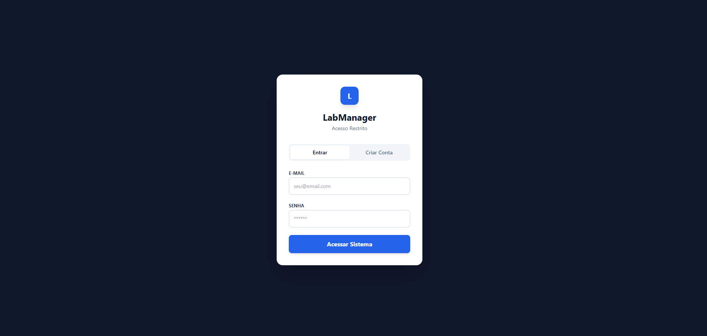
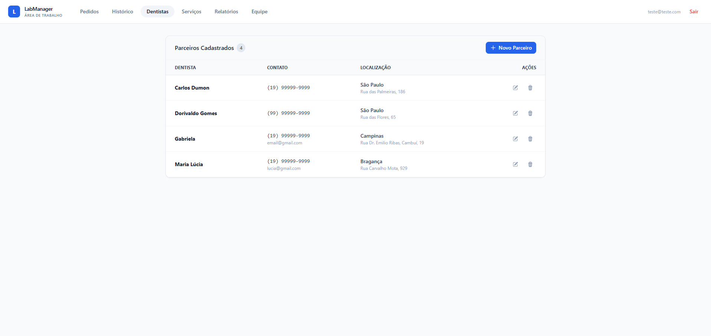
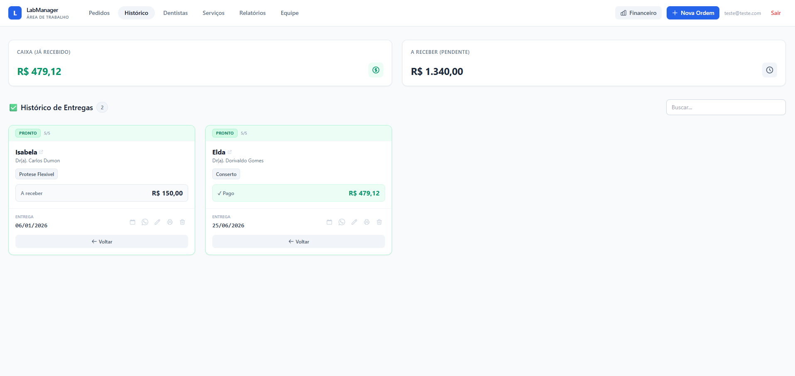
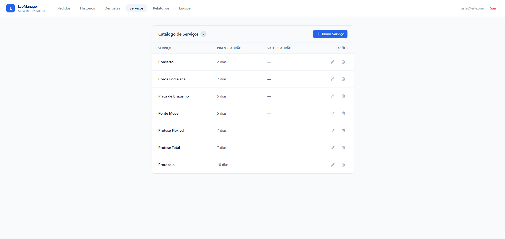
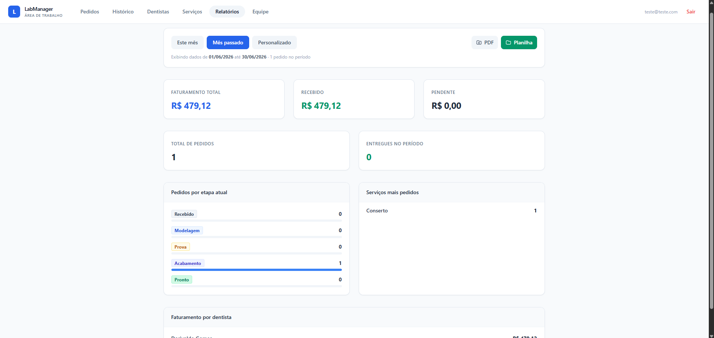

# 🦷 LabManager - Sistema de Gestão para Laboratório de Prótese

O **LabManager** é um sistema web desenvolvido para modernizar e organizar a gestão de um Laboratório de Prótese Dentária. O projeto substitui controles manuais por uma interface digital intuitiva, permitindo o acompanhamento de pedidos, controle financeiro e gestão de parceiros (dentistas).

> **Status:** 🚀 MVP (Produto Mínimo Viável) Finalizado e em Produção.

---

## 📸 Telas do Projeto

| Tela de Pedidos | Tela de Login |
|:-------------------:|:-----------------:|
|  |  |

| Cadastro de Dentistas | Histórico |
|:---------------------:|:------------------:|
|  |  |

| Serviços | Histórico |
|:---------------------:|:------------------:|
|  |  |

---

## 🛠 Tecnologias Utilizadas

Este projeto foi desenvolvido utilizando as tecnologias mais modernas do mercado para garantir performance e escalabilidade:

* **Frontend:** [React](https://reactjs.org/) + [Vite](https://vitejs.dev/)
* **Linguagem:** [TypeScript](https://www.typescriptlang.org/) (Tipagem estática para maior segurança)
* **Estilização:** [Tailwind CSS](https://tailwindcss.com/) (Design responsivo e ágil)
* **Banco de Dados:** [Firebase Firestore](https://firebase.google.com/) (NoSQL em tempo real)
* **Autenticação:** Firebase Authentication
* **Hospedagem:** Vercel / Firebase Hosting

---

## ✨ Funcionalidades Principais

* ✅ **Dashboard Interativo:** Visualização rápida de faturamento (A Receber vs. Recebido) e pedidos prioritários.
* ✅ **Gestão de O.S.:** Cadastro completo de ordens de serviço com status (Em Produção/Pronto).
* ✅ **Alerta de Atrasos:** Identificação visual automática de pedidos com prazo vencido.
* ✅ **Controle Financeiro:** Checkbox simples para marcar pagamentos realizados.
* ✅ **Cadastro de Dentistas:** CRUD completo com máscara automática de telefone.
* ✅ **Integração Google Agenda:** Botão para adicionar a data de entrega diretamente no calendário.
* ✅ **Impressão de Etiquetas:** Geração automática de PDF para identificação dos trabalhos.

---

## 🚀 Como Rodar o Projeto

### Pré-requisitos
* Node.js instalado
* Conta no Firebase (para configurar o banco)

### Passo a Passo

1.  **Clone o repositório:**
    ```bash
    git clone [https://github.com/italo-afr/lab-manager.git](https://github.com/italo-afr/lab-manager.git)
    cd lab-manager
    ```

2.  **Instale as dependências:**
    ```bash
    npm install
    ```

3.  **Configure o Firebase:**
    * Crie um arquivo `.env` na raiz do projeto.
    * Adicione suas chaves do Firebase (veja o arquivo de exemplo ou console do Firebase).

4.  **Rode o servidor local:**
    ```bash
    npm run dev
    ```
    O projeto abrirá em `http://localhost:5173`.

---

## 📄 Licença

Este projeto foi desenvolvido como parte de uma Atividade de Extensão Universitária.

**Desenvolvido por:** [Italo Afr]
